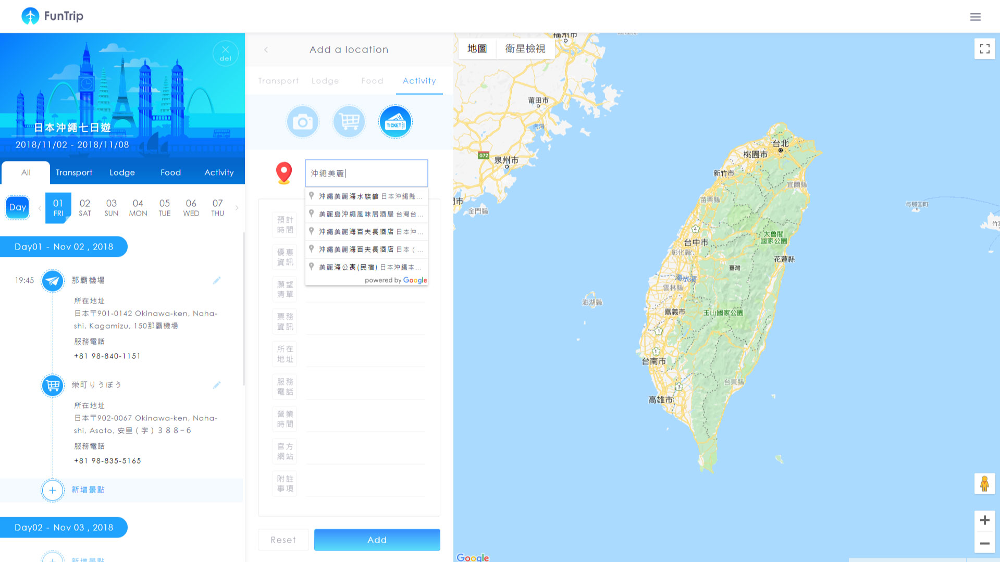
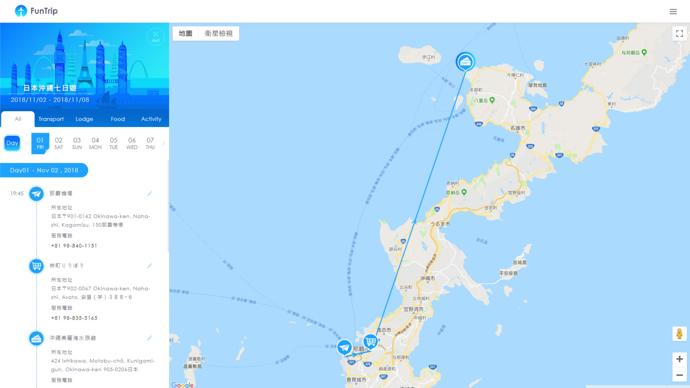

# FunTrip

A trip planning website that can see all kinds of markers of interesting events, locations, including lodges and restaurants related to current trip on map.
[Try it](https://funtrip-3d235.firebaseapp.com/)

## Implementation

 * Users can identify locations of any trip on the map with Markers of Google Maps API.

 * When a user starts typing a name of location, FunTrip integrated with the Place Library of Google Maps API that suggests the most relevant location options for users.

 * While a user makes a plan of visiting more than one places, Funtrip provides a visual connection between those places  with Polyline of Google Maps AIP.

 * With Firebase Realtime Database, any modifications of any trip plan will be updated immediately.

 * Users can filter any types of locations, events, activities information and see results immediately with the efficiency and benefit of state management from React.
